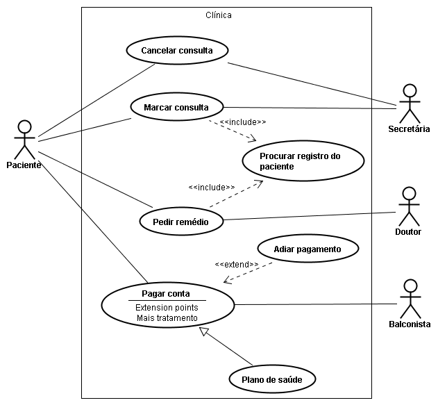
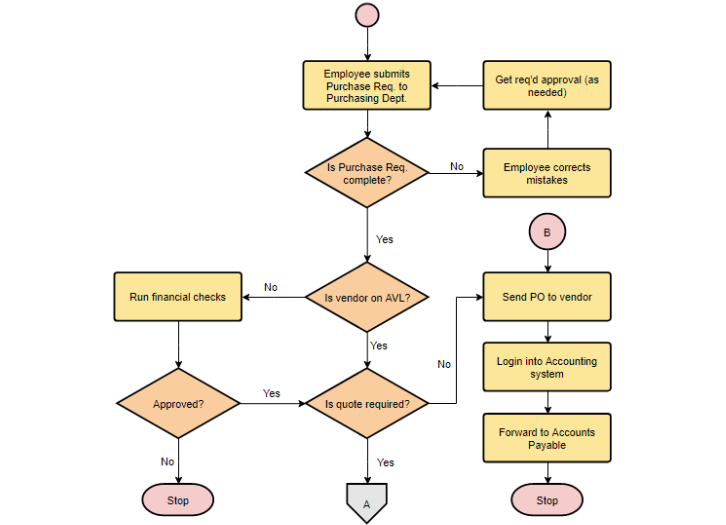

# Documentação

> Linha adicional de texto informativo sobre o que o projeto faz. Sua introdução deve ter cerca de 2 ou 3 linhas. Não exagere, as pessoas não vão ler.

## ☕ Regras específicas:
- Campo aleatorio deve possuir validação
- Footer deve conter as informações x, y, z  

## 💻 Diagrama de caso de uso

## 💻 Fluxograma

## 💻 Diagrama entidade-relacionamento

