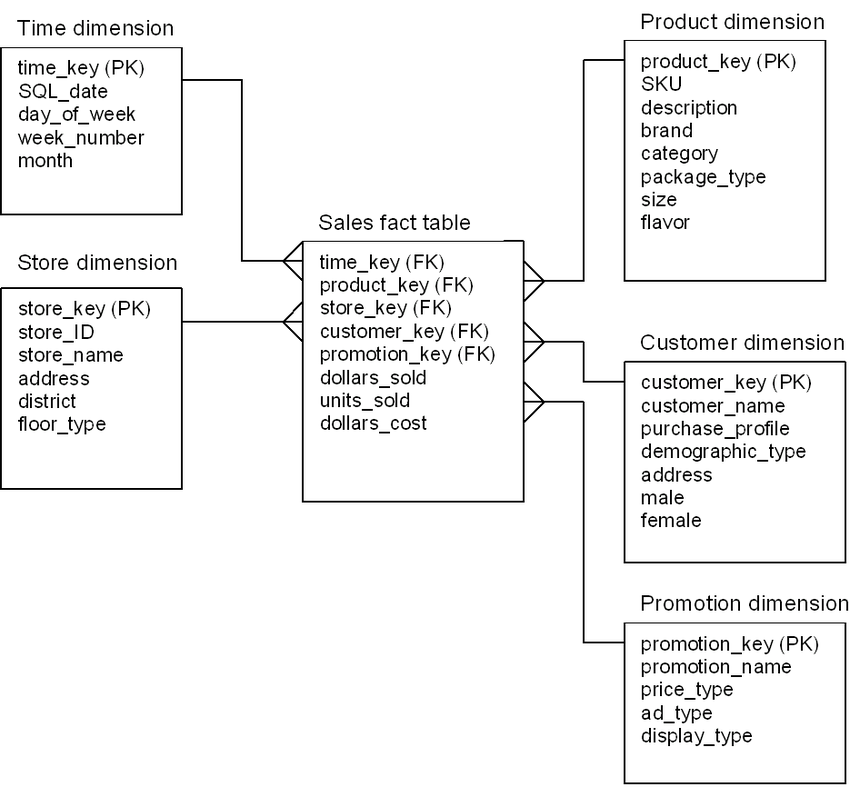

# Documentação

> Linha adicional de texto informativo sobre o que o projeto faz. Sua introdução deve ter cerca de 2 ou 3 linhas. Não exagere, as pessoas não vão ler.

## 💻 Modelagem de banco de dados

## ☕ Regras específicas:
- Campo <aleatorio> deve possuir validação
- Footer deve conter as informações x, y, z  
